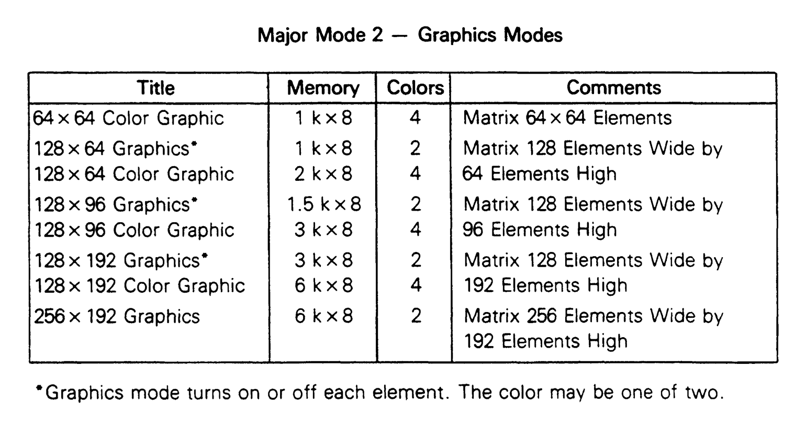
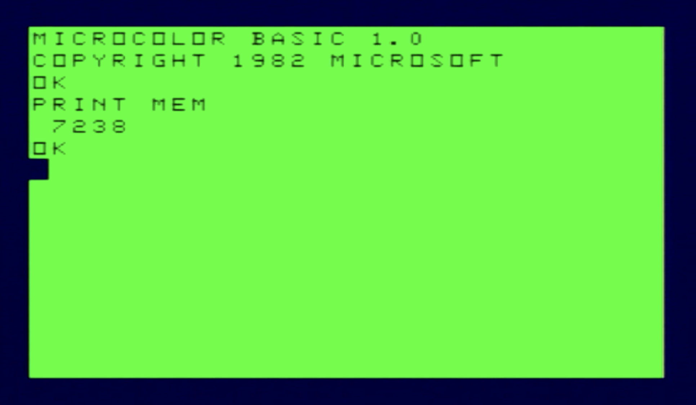
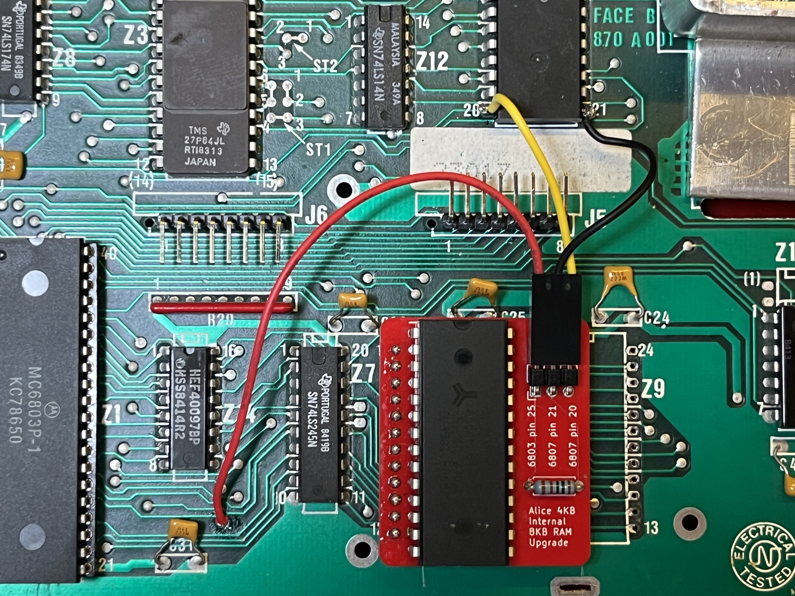
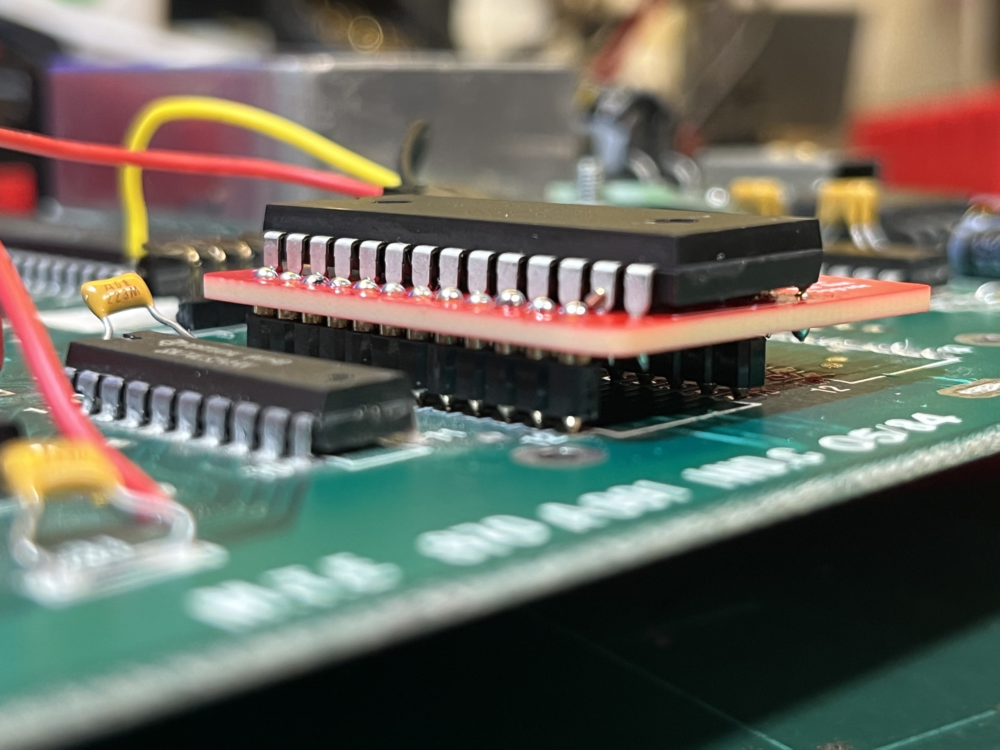
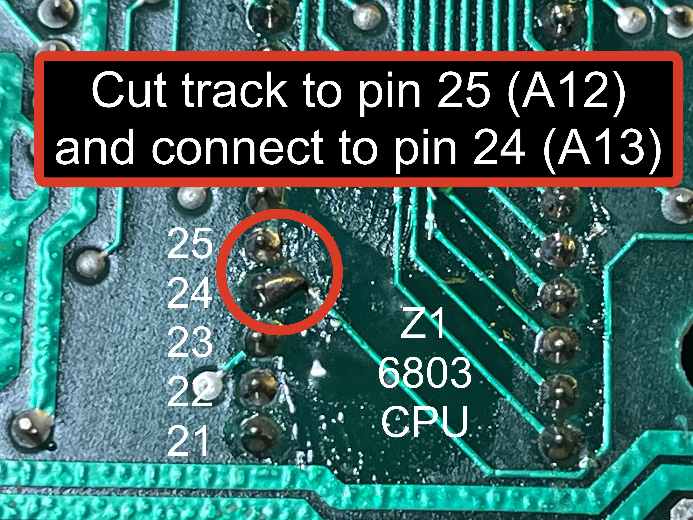

# Internal 4KB-to-8KB RAM Upgrade
## Background
This design is based on the work that Daniel Tufvesson documented on his [blog](https://www.waveguide.se/?article=expanding-the-trs-80-mc-10-internal-ram) for the Tandy TRS-80 MC-10. Please refer to his blog for the background and theory of the upgrade. 

Note that the additional 4KB is not usable with the 16KB RAM expansion as the expansion occupies the same space in memory. 

I have [tested it on my Alice](https://youtu.be/OvdkhOnV7no) but not yet (as of 27-Feb-2025) on my MC-10. 

## Why Do this?
The Alice/MC-10 shares its internal 4KB of RAM with the 6847 VDG.  The VDG can address up to 8KB of RAM but doesn't have access to the expansion bus, thus it can only access RAM that is installed internally.  The additional RAM allows access to additional video modes such as 128x192x4 and 256x192x2 graphics modes which require 6KB of RAM.  

Of course, software needs to be written to take advantage of this. 

## Free Memory
Standard Alice 4KB: 3142 bytes free 
Alice with 8KB: 7238 bytes free 
Standard Alice 4+16KB: 19526 bytes free 
Alice with 8+16KB: 19526 bytes free (additional 4KB overlapped) 

## Design
The MC-10 has a limitation with component height due to its rather [snug FCC shielding](https://www.waveguide.se/?article=getting-to-know-the-trs-80-mc-10) - the Matra Alice doesn't have this, hence this simple daughterboard design.  My MC-10 no longer has that limitation either! 

The Alice also doesn't have the bodge wiring for the 4KB address decoding that the MC-10 has. 

This is what the 8KB daughterboard looks like installed in the Alice: 

(Sidenote 1: yes, the crossing of the black and yellow 6847 VDG address wires annoys me too - I have since updated the PCB so they don't cross!) 

(Sidenote 2: the original Thomson 6803 CPU in my Alice was faulty causing [keyboard issues](https://youtu.be/A9SVZOl3z24) - I replaced it with a socketed Motorola 6803 seen on the left). 

On the MC-10 it is necessary to also move a bodge wire from A12 (6803 pin 25) to A13 (6803 pin 24).  On the Alice this simply requires cutting a track to pin 25 and connecting it to pin 24: 

## Bill Of Materials
- PCB (thanks to [PCBWay](www.pcbway.com) for their ongoing sponsorship)
- 6264 static RAM (I didn't bother with a socket to keep height to a minimum)
- 1KΩ resistor
- 3-pin right-angle header & 3-way Dupont-type wire (or just wire directly)
- two 12-pin headers (or single row cut into 12-pins)

For the 12-pin headers I normally use "turned" pins in case I'm installing into an IC socket.  In this case I've just installed directly onto the board so the more common square-shaped header pins could be used instead.
