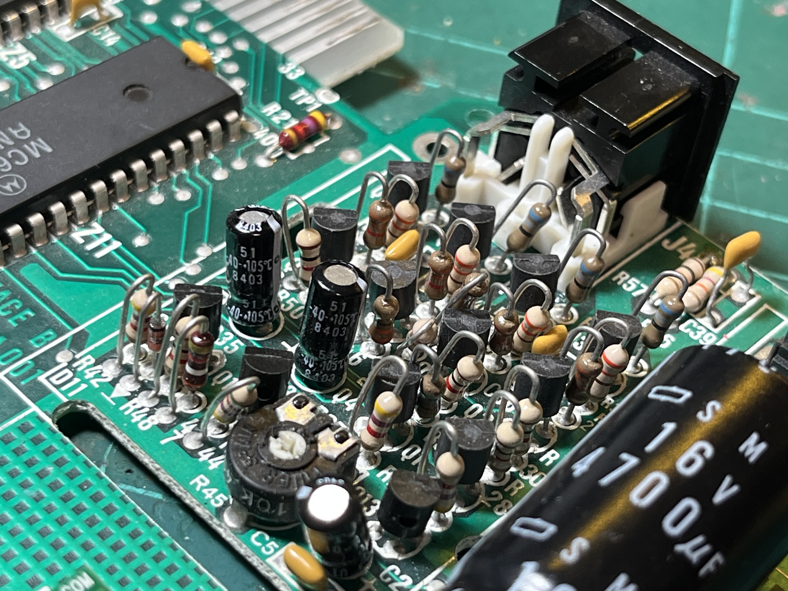

# RGB Video Modification
## Background
This design is based on the Matra Alice schematic.  The Alice outputs an RGB+Audio signal via a 7-pin DIN socket - this would normally be connected to a Peritel or SCART connector. 

## Design Notes
### Transistor Replacements
The original design uses obsolete transistors: BC172C (NPN) and BC252C (PNP).  I've tried to match with available transistors - not an expert, happy to be advised of better matches: 
BC172C -> BC550C 
BC252C -> BC560C 

### Video Pinout (7-pin DIN)
The video pinout is: 
- Pin 1 = Vcc (+12V) - only needed for SCART switching? 
- Pin 2 = ground
- Pin 3 = red
- Pin 4 = synch
- Pin 5 = green
- Pin 6 = audio
- Pin 7 = blue

The +12V connection to the DIN can be connected via solder bridge (default open). 

### Input Signals Required
- SYS_CLK_IN = U12 pin 12 (74LS14)
- SYS_CLK_OUT = U12 pin 13
- ΦA = U11 pin 11 (MC6847 VDG)
- ΦB = U11 pin 10 (MC6847 VDG)
- CHB = U11 pin 9 (MC6847 VDG)
- Y = U11 pin 28 (MC6847 VDG)

### Notable Differences Between Alice & MC-10
The crystal for the Alice is located next to the 6803 CPU whereas the MC-10's crystal is part of the RF modulator circuit, being generated by the MC1372.  This means that any modification to the MC-10's video output stage needs to include the crystal & system clock generation circuitry. 

At the moment I have the crystal & MC1372 being recovered and re-used. 

## Status
16-Mar-2025: 
Work in progress! 
The schematic is almost complete, verifying against the Alice schematic (a bit hard to see some parts) and an actual Alice. 
A PCB will then be designed and test PCBs fabricated.
